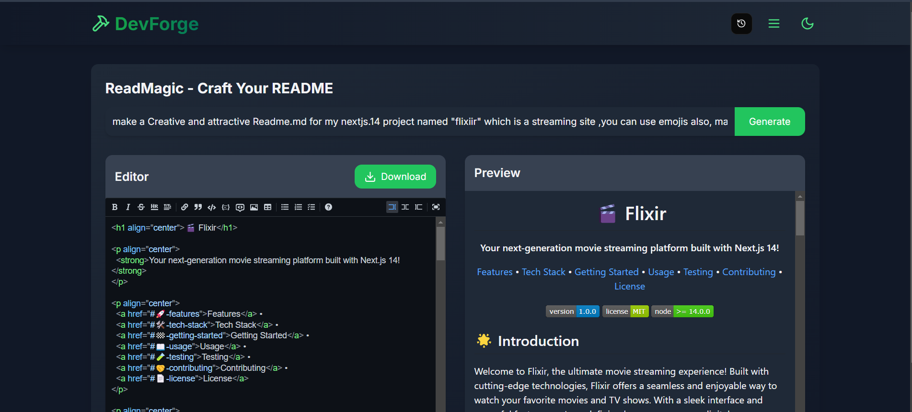

<h1 align="center">🛠️ DevForge</h1>
<p align="center">
  <strong>Your Ultimate Developer Toolkit for Project Documentation</strong>
</p>

<p align="center">
  <a href="#✨-introduction">Introduction</a> •
  <a href="#🚀-features">Features</a> •
  <a href="#🛠️-tech-stack">Tech Stack</a> •
  <a href="#🏁-getting-started">Getting Started</a> •
  <a href="#📖-usage">Usage</a> •
  <a href="#🤝-contributing">Contributing</a> •
  <a href="#📄-license">License</a>
</p>

<p align="center">
  
  
  
</p>

## ✨ Introduction
Welcome to DevForge, your all-in-one solution for project documentation and setup! DevForge combines AI-powered tools with developer-friendly interfaces to streamline your documentation workflow. From README generation to license management, we've got you covered.

<div align="center">
  
</div>

## 🚀 Features

### 📚 ReadMagic
- 🤖 **AI-Powered Generation**: Create READMEs instantly using Gemini Flash 1.5
- ✍️ **Real-time Editor**: Live preview and markdown formatting tools
- 🎨 **Rich Formatting**: Full markdown support with syntax highlighting
- 💾 **Export Options**: Download in multiple formats

### 🛡️ GitGuardian
- 📋 **Template Library**: Pre-built templates for popular frameworks
- 🎯 **Custom Patterns**: Add your own file patterns
- 🔄 **Smart Combining**: Merge multiple templates seamlessly
- ⚡ **Quick Generate**: One-click .gitignore creation

### 📦 PyDeps
- 🔍 **Smart Detection**: Automatically detect Python dependencies
- 📝 **Requirements.txt**: Generate complete dependency lists
- ✅ **Version Check**: Compatibility verification
- 📋 **Installation Guide**: Clear setup instructions

### ⚖️ LegalForge
- 📜 **License Templates**: Multiple license types available
- 🔄 **Auto-Update**: Dynamic year and author fields
- 🎨 **Custom Fields**: Personalize your license
- 💾 **Multiple Formats**: Export in various file types

## 🛠️ Tech Stack
- **Framework**: 
  - [Next.js 14](https://nextjs.org/)
  - [React](https://reactjs.org/)
  - [TypeScript](https://www.typescriptlang.org/)
- **Styling**: 
  - [Tailwind CSS](https://tailwindcss.com/)
  - [Shadcn/UI](https://ui.shadcn.com/)
- **AI Integration**:
  - [Gemini Flash 1.5](https://gemini.google.com/)

## 🏁 Getting Started

1. **Clone the repository**
   ```bash
   git clone https://github.com/Saoud30/devforge.git
   cd devforge
   ```

2. **Install dependencies**
   ```bash
   npm install
   ```

3. **Start the development server**
   ```bash
   npm run dev
   ```

4. Open [http://localhost:3000](http://localhost:3000) in your browser

## 📖 Usage

### ReadMagic
1. Enter your project description in the AI input bar
2. Click "Generate" to create your README
3. Edit using the rich text editor
4. Preview changes in real-time
5. Download when ready

### GitGuardian
1. Select project templates
2. Add custom file patterns
3. Click "Generate .gitignore"
4. Download and use

### PyDeps
1. Paste your Python script
2. Click "Generate requirements.txt"
3. Review dependencies
4. Use provided installation commands

### LegalForge
1. Choose license type
2. Fill in project details
3. Generate license file
4. Implement in your project

## 🤝 Contributing
We welcome contributions! Here's how you can help:

1. Fork the repository
2. Create your feature branch: `git checkout -b feature/amazing-feature`
3. Commit your changes: `git commit -m 'Add amazing feature'`
4. Push to the branch: `git push origin feature/amazing-feature`
5. Open a Pull Request

## 📄 License
This project is licensed under the MIT License - see the [LICENSE](LICENSE) file for details.

## 📞 Contact
- GitHub: [@Saoud30](https://github.com/Saoud30)
- Email: mohdhashimansari30@gmail.com
- Twitter: [@Shazyansar](https://twitter.com/Shazyansar)

<div align="center">
  Made with ❤️ by Shazy
</div>